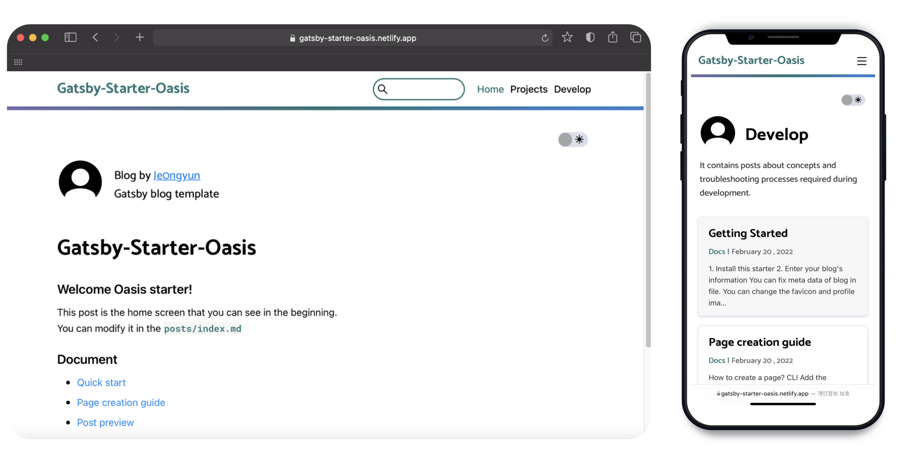

# Gatsby-Starter-Oasis

[](https://opensource.org/licenses/MIT) [](https://app.netlify.com/sites/gatsby-starter-oasis/deploys)

<br/>

**Oasis is a lightweight page-based starter with a highlight-based UI**

<sub>Project by <a href="https://github.com/je0ngyun">je0ngyun</a></sub>
<br/>



## 🖥 Demo

[gatsby-starter-oasis.netlify.app](https://gatsby-starter-oasis.netlify.app/)

## ✨ Features

- Code highlight
- highlight-based UI
- Based on [GitHub typography](https://kyleamathews.github.io/typography.js/)
- Scroll gauge bar
- [Utterances](https://utteranc.es/) Comment
- Dark mode support
- Page-based post classification
- Provides a page creation tool
- Provides a dedicated page for project introduction
- Detailed category sidebar support in PC
- Post search support in PC
- Stylesheet built using [SASS](https://sass-lang.com/)
- Responsive web design
- [Lighthouse](https://developers.google.com/web/tools/lighthouse) 98+ performance
- [Google Analytics](https://analytics.google.com/)
- RSS Feed
- Sitemap, Robots.txt
- SEO

## 🚄 Getting Started

### 1. Install this starter

```bash
# Create a gatsby site using this starter
npm install -g gatsby-cli
gatsby new my-blog https://github.com/je0ngyun/gatsby-starter-oasis

# or
npx gatsby new my-blog https://github.com/je0ngyun/gatsby-starter-oasis
```

### 2. Enter your blog's information

You can fix meta data of blog in `user-meta-config.js` file.  
You can change the favicon and profile image of blog in `assets` directory.

### 3. Running in Development

```bash
cd my-blog/
npm run develop
```

### 4. Add your content

You can write

- `posts/index.md file` - markdown post on the main screen.
- `posts/projects/ directory` - posts on the projects page.
- `posts/develop/ directory` - posts on the develop page.

If you want to know how the addresses of each post are generated, please read [Guide](#-Guide).

### 5. Deploy to Netlify

<a href="https://app.netlify.com/start/deploy?repository=https://github.com/je0ngyun/gatsby-starter-oasis" target="_blank"></a>

After clicking that button, you’ll authenticate with GitHub and choose a repository name. Netlify will then automatically create a repository in your GitHub account with a copy of the files from the template.

It's okay to use gh-page instead of netlify

## 📂 Some Folder Structure

```
.
├── assets
│   ├── favicon.png // your favicon
│   └── profile.png // your profile image
├── page-gen-template // templates referenced by the page creation tool
│   ├── template.js
│   └── template.scss
├── posts
│   ├── index.md // markdown post on the main screen
│   ├── develop // posts on the develop page
│   │   ├── devops // detailed category
│   │   ├── docs   // ...
│   │   └── nodejs // ...
│   └── projects // posts on the projects page
│       └── project-list // ...
├── src
│   ├── components
│   ├── hooks
│   ├── pages // routing except post
│   ├── styles // you can customize color
│   │   ├── dark-mode.scss
│   │   ├── light-mode.scss
│   │   ├── markdown.scss
│   │   ├── utils.scss
│   │   └── variables.scss
│   ├── templates
│   └── utils
│       └── typography.js // base typography
├── gatsby-browser.js // import typeface here
├── gatsby-config.js // gatsby config
├── gatsby-node.js
└── user-meta-config.js // you can set all meta config
```

## 🪄 Guide

### Supported frontmatter

1. General post

```bash
---
title: 'Welcome Oasis'
date: '2021-02-19 16:00:30'
tags: 'Gatsby,Starter,Blog' // separated by commas
---
```

2. Project post

```bash
---
title: "Gatsby-Starter-Oasis"
date: "2022-02-19 16:00:30"
tags: "lightweight, page-based gatsby starter" // one line summary
tech: "Gatsby,React,Sass" // separated by commas
period: "2022.01 ~ 2022.02"
desc: "desc1;desc2;desc3" // project description, separated by semicolon
---
```

### Post address and sidebar category

```
./posts/
├── develop
│   ├── my-post.md // 1
│   ├── devops
│   │   └── devops-category-post.md // 2
│   ├── docs
│   │   ├── page-creation-guide.md
│   │   ├── quick-start.md
│   │   └── test
│   │       └── quick-start2.md // 3
│   └── nodejs
│       └── nodejs-category-post.md
```

**In the above structure**, the categories of the sidebar of the develop page show devops, docs, and nodejs.

**Post 1** is created with the address `${your-site}/develop/my-post` and it does not belong to any category in the sidebar.

**Post 2** is created with the address `${your-site}/develop/devops/devops-category-post.`

In the case of **post 3**, it is created with the address of `${your-site}/develop/docs/test/quick-start2.`
It belongs to the docs category in the sidebar.

### How to create a page?

```bash
npm run page
```


Add the following to user-meta-config

```js
const pageMetadata = {
  //menu - Please enter a menu link to add to the navbar.
  //If you do not want to add a link to the navbar, you can leave it blank.
  menu: [
    { path: '/', linkname: 'Home' },
    { path: '/projects', linkname: 'Projects' },
    { path: '/develop', linkname: 'Develop' },
    { path: '/life', linkname: 'Life' }, // add!!
  ],
  //directorys - Enter the directory to be mapped with the page.
  //That directory is automatically linked to the gatsby filesystem.
  directorys: ['develop', 'projects', 'life'], // add life!!
}
```

### URL of RSS, Sitemap and Robots.txt

- RSS Feed -> `${user-site}`/rss.xml
- Sitemap -> `${user-site}`/sitemap/sitemap-index.xml
- Robots.txt -> `${user-site}`/robots.txt

## 🐛 Bug reporting

[gatsby-starter-oasis/issues](https://github.com/je0ngyun/gatsby-starter-oasis/issues)

## 🧾 License

[LICENSE](https://github.com/je0ngyun/gatsby-starter-oasis/blob/master/LICENSE)
